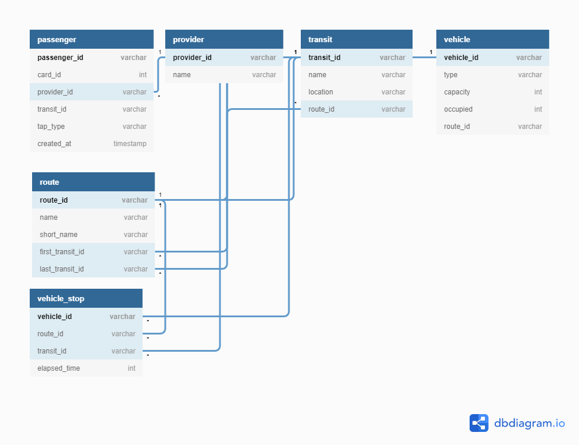

# Commuting App

## Description

Commuting App that display which transit to be avoided & realtime position of the vehicle that assigned to the route they choose

## Case

### Record Passenger

- Record Every Card That Tapped In & Out On The Machine

  - 

  - ## **passenger table**
    - passenger_id (random varchar)
    - card_id (tapped card number)
    - provider_id (FK from table provider)
    - transit_id (FK from table transit)
    - tap-type ("TAP-IN" : "TAP-OUT")
    - created_at (timestamp when the card tapped)

### Get Bus Ratio ("Seat 60% Occupied)

- Count How Many Passenger On The Bus

  - 

  - ## **Algorithm**

    - Count Passenger That Going To The Same Route As The Bus Route
    - Count The Bus Capacity
    - Count The How Many Bus Assigned To The Route
    - Count Passenger That "TAP-OUT" Card At That Route

### How Crowded The Stop Is ("Uncrowded" : "Crowded" : "Very Crowded")

- Calculate How Crowded The Stop

  - 

  - ## **Algorithm**

    - Count How Many Passenger "TAP-IN" At The Stop
    - Count How Many Passenger Already In The Bus

### Stop Recomendation

- Display Stop Recomendation

  -

  - ## **Algorithm**

    - Calculate How Crowded The Stop Is
    - Count How Many Passenger In That Stop With The Same Route
    - Count Occupied Bus
    - Calculate Distance Between Stop And GPS Location

### User Interface

### Database Diagram

### Link(s)

- [DB Diagram](https://dbdiagram.io/d/5f52e8e088d052352cb60a3f)
- [User Interface](https://www.figma.com/file/kqza8RXI8IggfZ472QAVUY/Untitled?node-id=0%3A1)
- [Files (password: fwzfag2)](https://gofile.io/d/zvFmRR)
